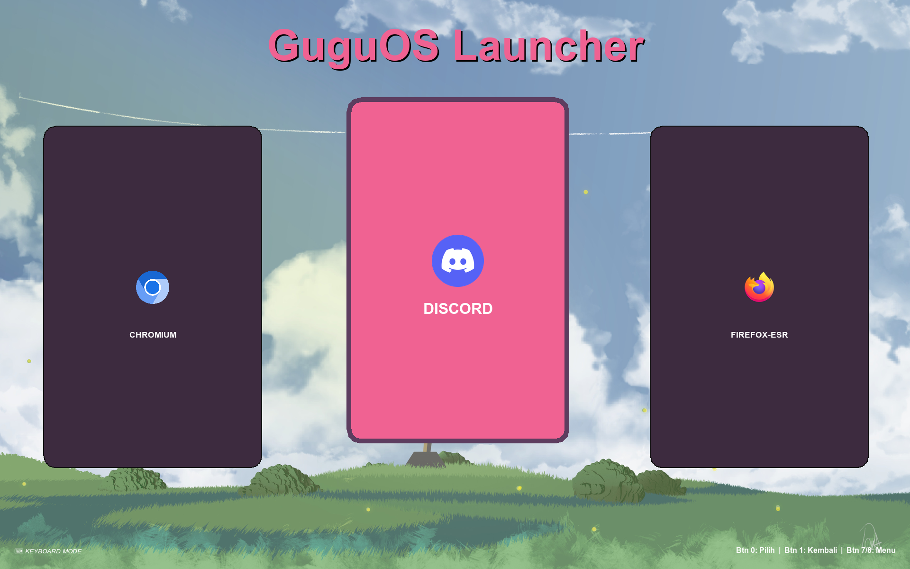
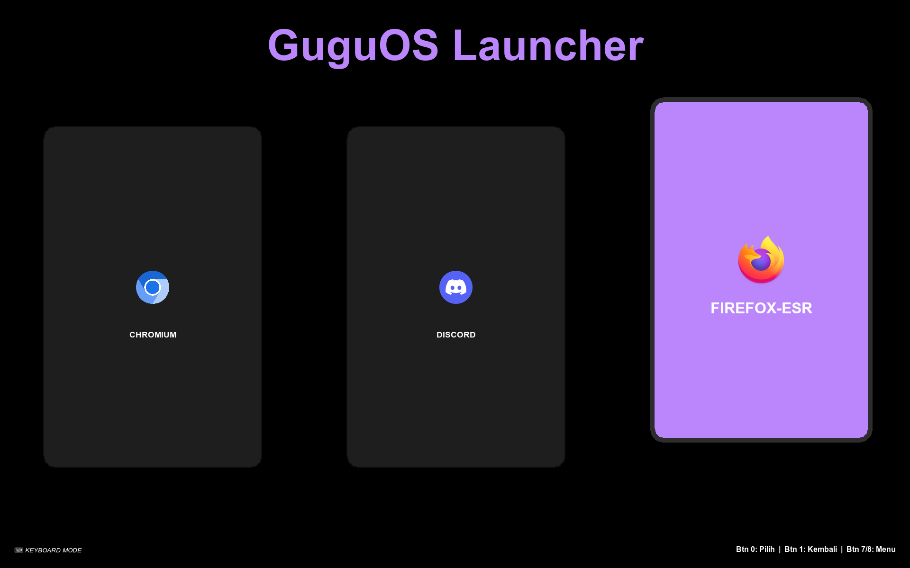

# 🎮 GuguOS Launcher

GuguOS Launcher is a **fullscreen launcher built with Python (Tkinter)**
---

## ✨ Key Features

- 🎮 Full navigation using **Gamepad / Keyboard**
- 🖥️ Fullscreen interface with smooth animations
- 🗂️ Launcher based on **`.sh` shortcut scripts**
- 🎨 Multiple themes (Default, Dark, Pinky)
- 🖼️ Wallpaper support with multiple modes (Fill, Stretch, Fit, etc.)
- 🌐 Multi-language support (Indonesian & English)
- ⌨️ Virtual Keyboard (for gamepad text input)
- 🔌 Power menu (Shutdown, Reboot, Logout)
- 📦 Detects OS applications from `.desktop` files
- 🖼️ Custom application icons and covers
- 🎮 Automatic gamepad detection + manual rescan


## 📦 Dependencies & Installation

### Arch Linux
```bash
sudo pacman -S python python-pillow python-pygame tk
```

### Debian / AntiX / Ubuntu
```bash
sudo apt install python3 python3-tk python3-pil python3-pil.imagetk python3-pygame
```

### Fedora
```bash
sudo dnf install python3 python3-tkinter python3-pillow python3-pygame
```

### Void Linux
```bash
sudo xbps-install python3 python3-tkinter python3-Pillow python3-pygame
```

## 📂 Extracting & Running

```bash
tar -xf launchergugu_alpha_0.0.1.tar.gz -C ~/
```
```bash
cd ~/.launchergugu
```
## 📂 How to Launch?
```bash
python3 launcher_pad.py
```
### Or
```bash
./launch.sh
```
### Or

### Just Double click launch.sh if using pcmanfm
---

## ⌨️ Keyboard Shortcuts

| Key | Function |
|----|---------|
| Arrow Keys | Navigate |
| Enter | Select / Confirm |
| Backspace | Back |
| Esc | Power Menu |
| **S / Shift + S** | Rescan Gamepad |

---

## 📜 License

Free to use, modify, and distribute.
